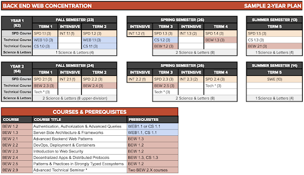
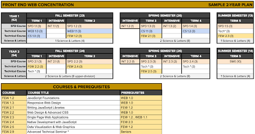
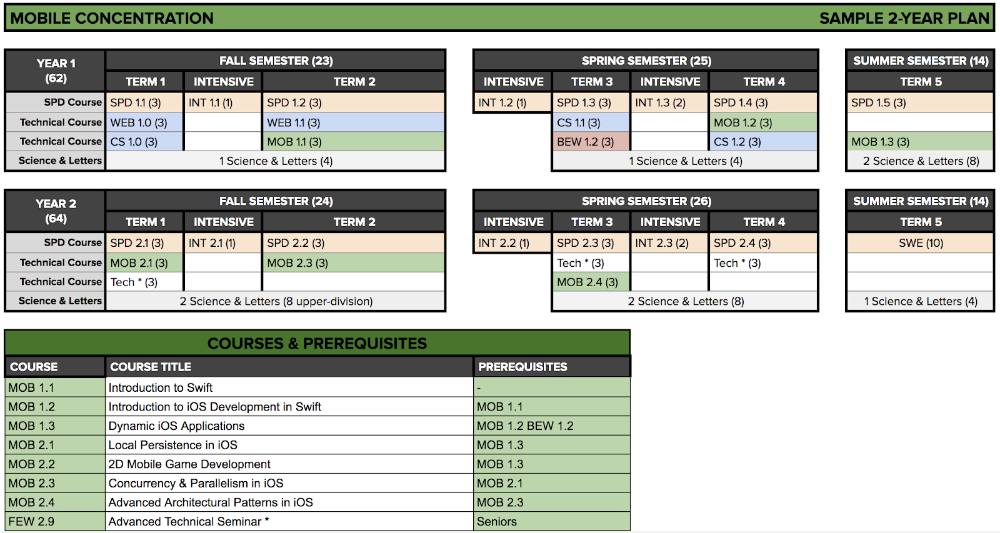
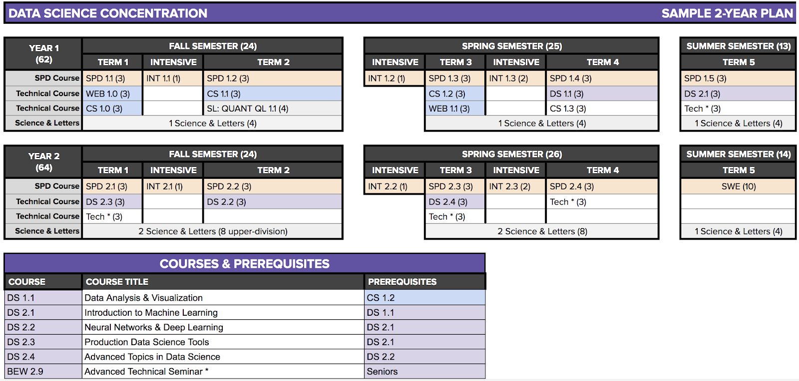

# Sample Course Sequencing by Concentration

It is important to be aware of course prerequisites and limited offerings in order to choose courses
each term. To see all of our course offerings, including descriptions and prerequisites, visit:
[make.sc/course-offerings](http://make.sc/course-offerings). To see which classes will be offered in
future terms please visit [make.sc/course-schedule](https://make.sc/course-schedule) to see the
yearly schedule and [make.sc/course-registrations](https://make.sc/course-registrations) to see the
schedule for this term.

Sample course sequencing shown below is one option, but your actual schedule may be different.

## BEW: Backend Web Development

Students must take six 3-unit courses from BEW 1.2, BEW 1.3, BEW 2.1, BEW 2.2, BEW 2.3, BEW 2.4, BEW
2.5 or BEW 2.9, five 3-unit foundation courses, and four 3-unit electives as well as all SPD, INT
and S&L courses.

- Students are encouraged to take CS 1.3 as one of their technical electives.
- Key Prerequisites: WEB 1.0 -> WEB 1.1 -> BEW 1.2 -> Most other BEW courses, BEW 1.3 -> BEW 2.1

## FEW: Frontend Web Development

Students must take six 3-unit courses from FEW 1.2, FEW 1.3, FEW 2.1, FEW 2.2, FEW 2.3, FEW 2.4, FEW
2.5, FEW 2.6 or FEW 2.9, five 3-unit foundation courses, and four 3-unit electives as well as all
SPD, INT and S&L courses.

- Key Prerequisites: WEB 1.0 -> FEW 1.2 -> Most FEW Courses, WEB 1.1 and FEW 1.2 -> FEW 2.3 -> FEW
  2.4

## MOB: Mobile Development

Students must take six 3-unit courses from MOB 1.1, MOB 1.2, MOB 1.3, MOB 2.1, MOB 2.2, MOB 2.3, MOB
2.4, five 3-unit foundation courses, and four 3-unit electives as well as all SPD, INT and S&L
courses.

- Students must also take BEW 1.2 as one of their technical electives as it is a prerequisite for
  MOB 1.3
- Key Prerequisites: Most Mobile courses have the previous course as a prerequisite and must be
  taken in order. MOB 1.1 ->MOB 1.2 -> MOB 2.1 and MOB 2.2 MOB 1.3 ->MOB 2.3 and MOB 2.4

## DS: Data Science

Students must take six 3-unit courses from DS 1.0, DS 1.1, DS 2.1, DS 2.2, DS 2.3, DS 2.4, DS 2.5,
five 3-unit foundation courses, and four 3-unit electives as well as all SPD, INT and S&L courses.

- Students are strongly encouraged to take CS 1.3 as an elective.
- Students must have met their Quantitative Literacy Requirement or take QL 1.1 prior to DS 1.0
- Key Prerequisites: Most Data Science courses have the previous course as a prerequisite and must
  be taken in order. MATH 1450, CS 1.1 ->DS 1.0 ->DS 1.1, DS 2.1 and DS 2.2 -> DS 2.3, DS 2.4

